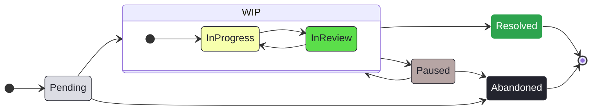

# Contributing

A guide on how to contribute to 'voice-revive'.

## Branching

### Main

This project follows a standard approach. The `main` branch is for **stable, production-ready** release versions of the code. It is also the repository's default branch.  
**Only** the `dev` branch is allowed to interact with `main` via merges or rebases.  
Exceptions are solely made for branches that are associated with an issue of `Critical` priority ([see Priority and Size](#priority--size)).  

### Dev

The `dev` branch exists for **ongoing changes**. **Feature branches** divert from here and are integrated back via merges or rebases.  
The bare minimum for a merge/rebase of a feature branch into `dev` is a passing pipeline **and** fulfilling all acceptance criteria of the issue.  

### Feature Branches

Each feature branch **must** have an associated issue, and in fact, **must** be created from an issue ([see Issue Creation](#issue-creation) step 11, and step 1 to 5).  
In turn, each issue **must** be created from an issue form ([see Issue Creation](#issue-creation) step 1 to 5) and **not** via a blank issue.  
The names of branches follow the pattern `[issue-number]-[kebap-cased-issue-type]-[kebap-cased-issue-name]` (without brackets).  
This is generated automatically by following the specified process for [issue creations](#issue-creation), especially step 6.  

## Commits

Commit messages must follow [Conventional Commits](https://www.conventionalcommits.org/en/v1.0.0/).  
Therefore, each contributing person should have an appropriate tool installed locally, which enforces these conventions.

## Issue Tracking

**GitHub Projects** is used for issue tracking and creation (and implicitly for branch creation).

### Issue States

There are six columns, which indicate the status of an issue:

- `Pending`: Issues in here are neither accepted nor rejected yet.
- `InProgress`: Issues in here were accepted and are currently being worked on.
- `InReview`: Issues in here are review ready or currently being reviewed.
- `Resolved`: Issues in here were reviewed and afterwards got merged into one of the main branches.
- `Paused`: Issues in here were started in the past but are currently not being worked on.
- `Abandoned`: Issues in here will not be resolved.

Issues can be moved between these columns via _drag and drop_ to change their state.  
Issues that are moved into `Resolved` must be `closed as completed`.  
Issues that are moved into `Abandoned` must be `closed as not planned`.  
Here, a visualization over possible state changes:

Of course, the ideal workflow would be `None`→`InProgress`→`InReview`→`Resolved`.

### Issue Creation

Issues are created in the project's `backlog` view.

1. In the `Pending` column, click `+ Add Item`.
2. Click the `+` appearing to the left.
3. Click `Create new issue`.
4. Make sure that the correct repository is selected at the top.
5. Then, choose an adequate issue form. Each form has an aiding description text.
6. Change the kebap-cased part of the issue's title (keep it in **lowercase**).
7. Fill out as much fields as possible. At least, all necessary fields must be non-empty. These fields are marked by a red `*`.
8. Click on `Create`.
9. Select the new issue in the `backlog` view.
10. Set assignees, priority, and size. Optionally, add more fitting `Flag:` or `For:` labels.
11. As soon as active work on the issue starts: Select the issue in the `backlog` view, then click `Create a branch` on the right.
12. Make sure the `repository destination` is correct and the `branch source` is set to `dev` (except for issues with `Critical` priority where it should be `main`, see below)

**Never** add, remove, or change any associations (or the lack thereof) between an issue and its predefined `Type:` label.

### Priority & Size

Each issue needs an associated **priority**. There are four different values available:

- `Low`: The issue should be resolved at some point, but only if there is no issue with a higher priority present.
- `Medium`: The issue should be resolved in the near future and only trumps low-priority issues.
- `High`: The issue should be resolved as soon as possible and can only be trumped by a critical-priority issue.
- `Critical`: Reserved for hotfixes of the main branches, like, security issues, critical bugs, etc.

Each issue needs a **size estimation**. There are four different values available for estimating the amount of work for an issue:

- `Small`: The issue can probably be dealt with within a single day of concentrated work by the team.
- `Medium`: The issue can probably be dealt with within a single week of concentrated work by the team.
- `Large`: The issue can probably be dealt with within a single month of concentrated work by the team.
- `Longterm`: The issue probably needs at least a month of concentrated work by the team.

## Development Environment

The project is developed in Visual Studio Code (VSCode).  
VSCode's in-built **workspace extensions and settings recommendation system** is used to share and sync configurations of the development environment across the team.  
These workspace extensions and settings **must** be used by all contributors to ensure a consistent development environment.
